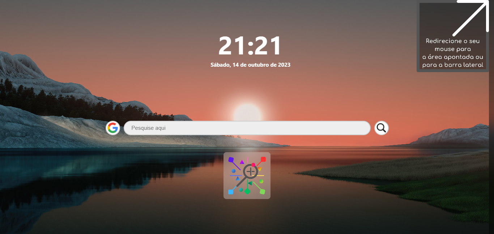
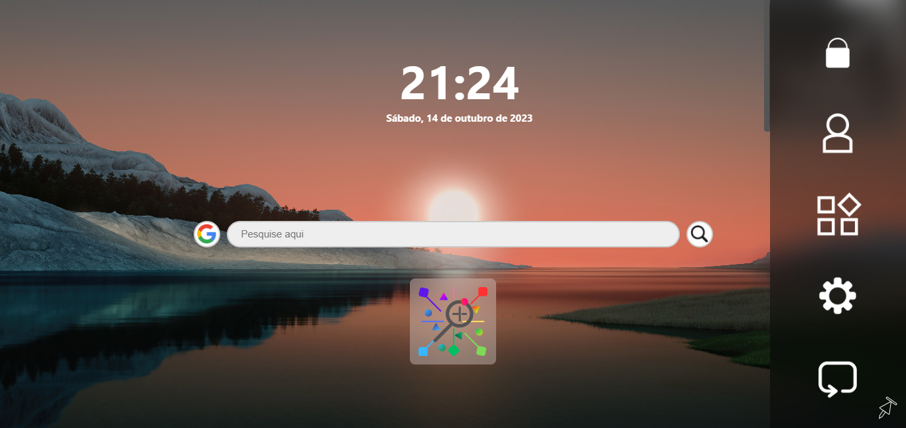
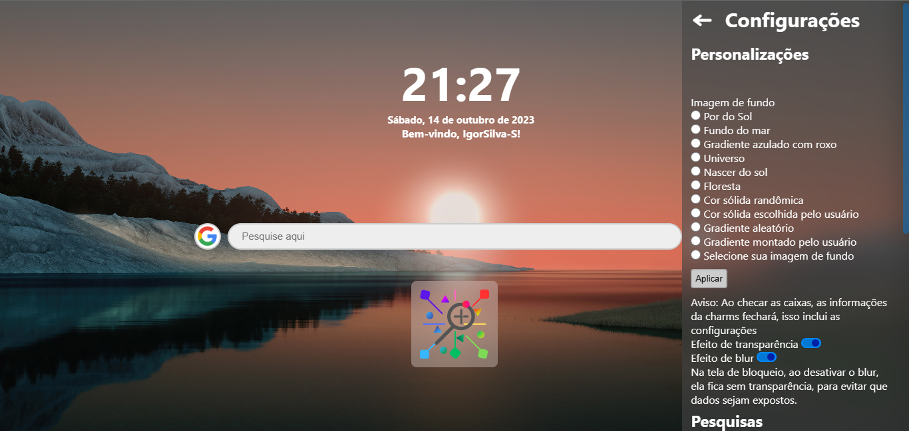
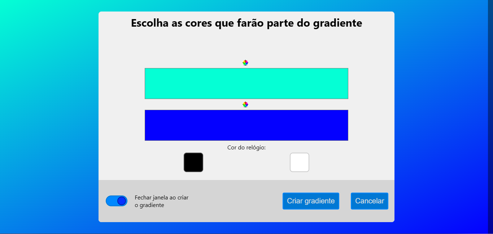
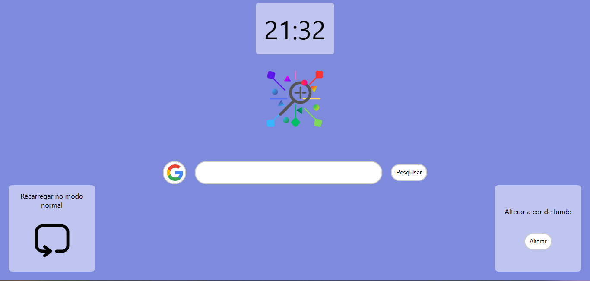
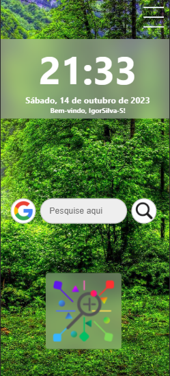
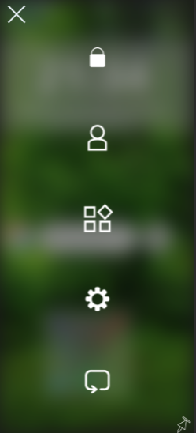
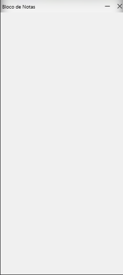
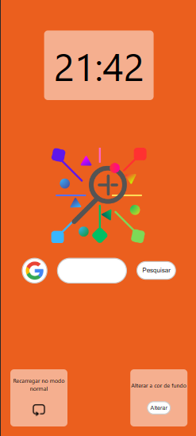

# New Tab Screen

Este projeto traz uma nova experiência para as páginas de redirecionamento

# Tópicos do site
 * <a href="#aplicações">Aplicativos integrados</a>
 * <a href="#customizações">Customizações</a>
 * <a href="#barralateral">Barra lateral</a>
 * <a href="#Access">Acessibilidade</a>
 * <a href="#Locks">Bloqueio do site</a>
 * <a href="#Reset">Recarregamento do site</a>

 ___

## Aplicações
Este projeto procura trazer alguns aplicativos integrados nele, para que se possa trabalhar com mais facilidade, sem ter que abrir sites externos para coisas simples como fazer cálculos e edições simples de textos, enquanto ouve a sua música favorita!

## Customizações
Você pode customizar a página para que fique com a sua cara, com as imagens pre-definidas, cores e gradientes que você escolhe e suas próprias imagens, além de poder alterar blur e transparência da barra lateral

## Barra lateral
Veja tudo que você pode fazer facilmente com a barra lateral, apelidada de "Charms", com um deslizar do mouse, você tem acesso as 6 funções do site: Bloqueio, Usuário, Recomendações, Aplicativos, Configurações e Recarregamento, tudo isso, na palma da sua mão!

## Acessibilidade
É difícil ver o relógio ou está ruim de ler o que está digitando? Use as funções de acessibilidade ao seu favor! Temos como alterar a cor do relógio, colocar um fundo, caso esteja difícil ver com a imagem, cor de fundo escolhida, alterar tamanho dos botões e mais, tudo para que você tenha a melhor experiência com o site.

## Bloqueio de site
Não quer espalhar informações sigilosas enquanto usa o bloco de notas? então experimente bloquear o site, apenas escolha a senha que será usada e faça o bloqueio, com um design intuitivo e simples, fica fácil o bloqueio e desbolqueio, além de proteger as informações que você tem.

## Recarregamento
O site está muito confuso? Deseja apagar todas as informações que você inseriu? Deseja usar o site em Inglês ou em Português? Tem como com a barra de recarregamento. Nela, você pode usar o modelo simples do site, deletar as informações salvas e trocar o idioma do site.

___

# Capturas de tela
## Desktop

## Mobile

___

# Ajuda

Caso queira colaborar no projeto com ideias, propostas de apps e outros, seu comentário é bem-vindo e pode ser retornado.

